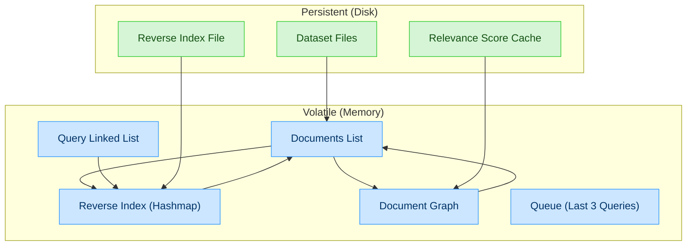

# Report: Building a search engine like Google 
**Grup:** Martí Gallego, Marc Bermudo, Marçal Bosch  

## C4 Component Diagram

> Volàtil (Memòria): Fa servir el color blau 
> Persistent (arxiu en el disc): Fa servir el color verd

## Runtime Complexity Analysis (taula)

## Search Time Analysis: With/Without Reverse Index (gràfica)

## Initialization Time vs Hashmap Slot Count (gràfica)

## Search Time vs Hashmap Slot Count (gràfica)

## Reverse Index Improvement Proposal