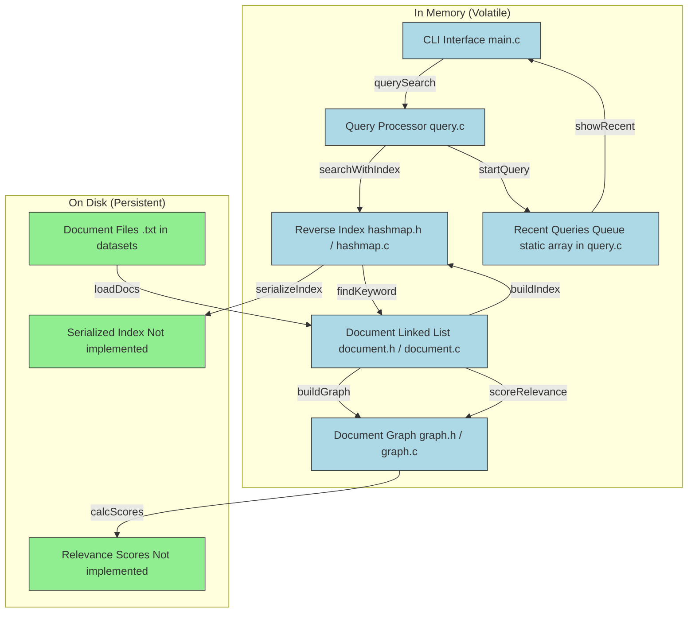

# Report: Building a search engine like Google 
**Grup:** Martí Gallego, Marc Bermudo, Marçal Bosch  

## C4 Component Diagram

> Volàtil (Memòria): Fa servir el color blau 
> Persistent (arxiu en el disc): Fa servir el color verd

## Runtime Complexity Analysis (taula)
| Description                                                                 | Big-O           | Justification                                                                                                                                                                                                                                                                                              |
|-----------------------------------------------------------------------------|-----------------|------------------------------------------------------------------------------------------------------------------------------------------------------------------------------------------------------------------------------------------------------------------------------------------------------------|
| Parsing a document into the struct (including adding links)                 | O(N + L²)       | **N**: Total characters in document (file read). **L**: Number of links. Each link insertion traverses existing list (O(L) per insertion → Σ(1 to L) = O(L²). Body processing O(N).                                                                                                                       |
| Parsing a query into the struct                                             | O(m)            | **m**: Query string length. Single pass for tokenization (strtok) O(m) + O(1) per word insertion (maintains tail pointer). K words processed but tokenization dominates.                                                                                                                                |
| Counting neighbours in the graph (total edges)                              | O(1)            | Direct access to precomputed `graf->totalEnllaços` field. No traversal needed.                                                                                                                                                                                                                              |
| Counting neighbours of a specific document                                  | O(1) avg        | Hash lookup (O(1) avg) + direct access to `grauEntrant`/`grauSortint` in NodeGrau. No adjacency list traversal.                                                                                                                                                                                          |
| Finding docs containing a keyword (reverse-index)                           | O(W + C)        | **W**: Keyword length (normalization+hashing). **C**: Collision chain length. Hashing O(W), bucket access O(1) avg, chain scan O(C). Returns pointer without traversing document list.                                                                                                                     |
| Finding docs matching all keywords in query                                 | O(K·D²)         | **K**: Keywords. **D**: Max document list size. First keyword: O(d₁). Subsequent keywords: Nested loop intersection - for each of R docs in current result, scan S docs in new list (O(R·S)). Worst-case R=S=D → O(D²) per keyword → O(K·D²). First term O(D) dominated by O(D²). |
>Variables:
>>D = número total de caracteres o tokens en un documento 
>>L = número de enlaces en ese documento 
>>K = número de palabras (keywords) en la consulta 
>>V = número de documentos (nodos del grafo) 
>>E = número total de enlaces (aristas) en el grafo 
>>m, m_i = tamaño de la lista de documentos para cada palabra 
>> M = número de documentos que coinciden con la consulta (≤ 5 en la salida) 

## Search Time Analysis: With/Without Reverse Index (gràfica)
Per avaluar l'eficiència del motor de cerca, s'ha implementat una funció (`comparaMetodesBusqueda`) que mesura el temps d'execució (en mil·lisegons) de dues estratègies:

- **Cerca sense índex invertit**: es fa una cerca lineal per tots els documents, comprovant si cada paraula clau apareix en el títol o el cos del document.
- **Cerca amb índex invertit**: es consulta un `hashmap` que relaciona cada paraula amb els documents que la contenen, millorant notablement el temps de resposta.

## Initialization Time vs Hashmap Slot Count (gràfica)

## Search Time vs Hashmap Slot Count (gràfica)

## Reverse Index Improvement Proposal